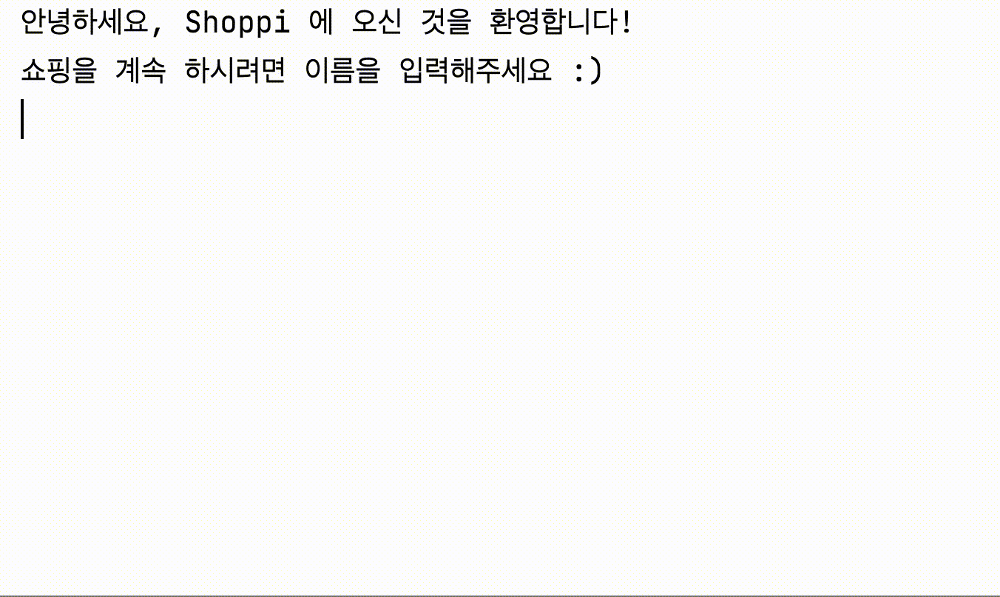

Shoppi Kotlin Console App
=========================

### 이 프로젝트는 [안드로이드 앱개발 부트캠프](https://www.udemy.com/course/learn-android-development-with-kotlin/) 강의 내용 중 **Kotlin Basics 섹션**의 실습 내용을 다룹니다.

</img>

### 안내
- Kotlin 입문자가 여러 문법적 요소를 학습하고 활용해 볼 수 있도록 단계별 구현을 수행하는 프로젝트입니다.
- 단계별로 요구사항을 추가하며 실습하는 프로젝트로 미구현된 기능들이 있습니다.

## 참고 : Kotlin Basics Overview
### 개념
- 1강: 변수, 타입, 이진법과 비트 연산
- 2강: Null, operator(?. ?: !! is as), conditions & loop
- 3강: 객체, 클래스, 함수, 가시성 변경자
- 4강: 컬렉션, object, extensions, generics, 함수 타입, 람다, Scope 함수
- 5강: enum class, sealed class, Stack

### 실습 주제
1. 사용자 정보 저장 & 출력
2. 선택메뉴 표기 & 사용자 입력 처리
3. 역할 분리 & 가독성 높이기
4. 싱글턴 객체 & extension 함수 활용
5. sealed class 활용 & Stack 구현
